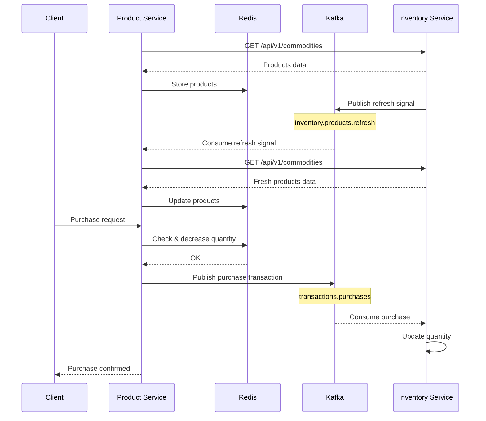

```mermaid
sequenceDiagram
    participant Client
    participant Product Service
    participant Redis
    participant Kafka
    participant Inventory Service

    %% Initial data load
    Product Service->>Inventory Service: GET /api/v1/commodities
    Inventory Service-->>Product Service: Products data
    Product Service->>Redis: Store products

    %% Product update flow
    Inventory Service->>Kafka: Publish refresh signal
    Note over Kafka: inventory.products.refresh
    Kafka-->>Product Service: Consume refresh signal
    Product Service->>Inventory Service: GET /api/v1/commodities
    Inventory Service-->>Product Service: Fresh products data
    Product Service->>Redis: Update products

    %% Purchase flow
    Client->>Product Service: Purchase request
    Product Service->>Redis: Check & decrease quantity
    Redis-->>Product Service: OK
    Product Service->>Kafka: Publish purchase transaction
    Note over Kafka: transactions.purchases
    Kafka-->>Inventory Service: Consume purchase
    Inventory Service->>Inventory Service: Update quantity
    Product Service-->>Client: Purchase confirmed
```
