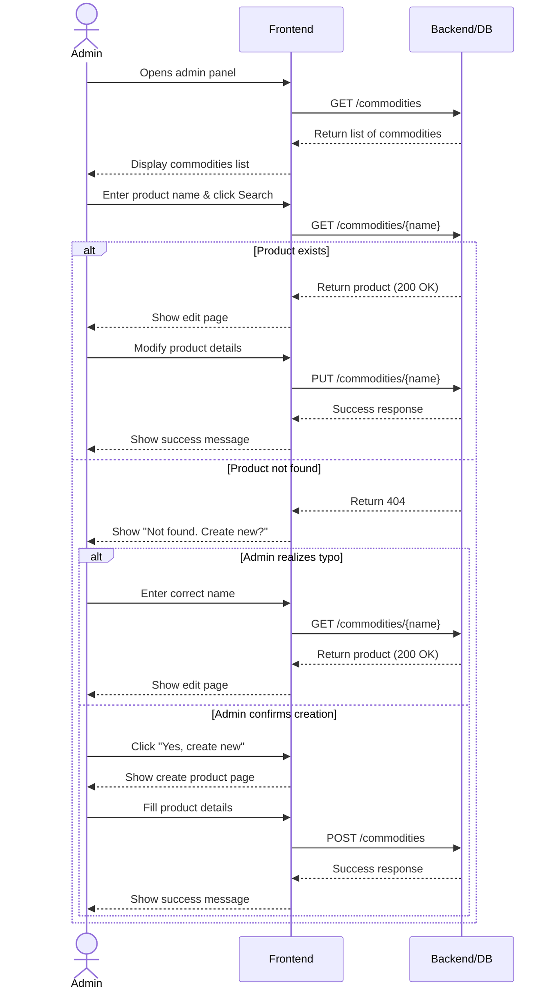

```mermaid
sequenceDiagram
    actor A as Admin
    participant F as Frontend
    participant B as Backend/DB

    A->>F: Opens admin panel
    F->>B: GET /commodities
    B-->>F: Return list of commodities
    F-->>A: Display commodities list

    A->>F: Enter product name & click Search
    F->>B: GET /commodities/{name}

    alt Product exists
        B-->>F: Return product (200 OK)
        F-->>A: Show edit page
        A->>F: Modify product details
        F->>B: PUT /commodities/{name}
        B-->>F: Success response
        F-->>A: Show success message
    else Product not found
        B-->>F: Return 404
        F-->>A: Show "Not found. Create new?"
        
        alt Admin realizes typo
            A->>F: Enter correct name
            F->>B: GET /commodities/{name}
            B-->>F: Return product (200 OK)
            F-->>A: Show edit page
        else Admin confirms creation
            A->>F: Click "Yes, create new"
            F-->>A: Show create product page
            A->>F: Fill product details
            F->>B: POST /commodities
            B-->>F: Success response
            F-->>A: Show success message
        end
    end

```