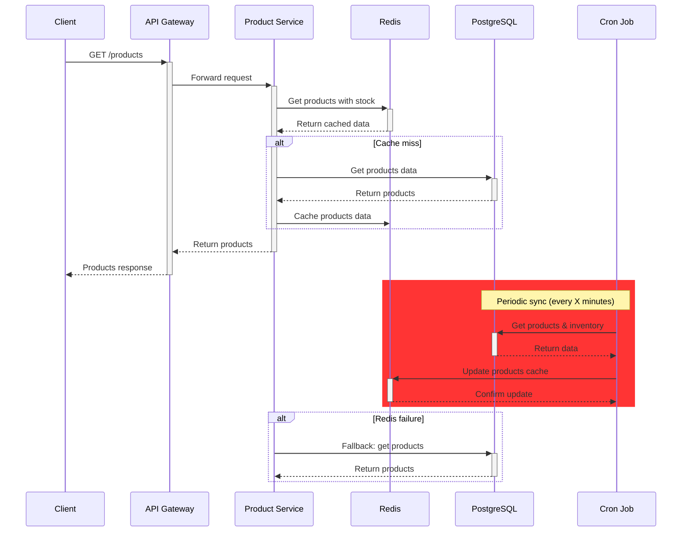

```mermaid
sequenceDiagram
    participant Client
    participant API Gateway
    participant Product Service
    participant Redis
    participant PostgreSQL
    participant Cron Job

    %% Regular product listing flow
    Client->>+API Gateway: GET /products
    API Gateway->>+Product Service: Forward request
    Product Service->>+Redis: Get products with stock
    Redis-->>-Product Service: Return cached data

    alt Cache miss
        Product Service->>+PostgreSQL: Get products data
        PostgreSQL-->>-Product Service: Return products
        Product Service->>Redis: Cache products data
    end

    Product Service-->>-API Gateway: Return products
    API Gateway-->>-Client: Products response

    %% Cron job flow
    rect rgb(255, 52, 52)
        Note over Cron Job,PostgreSQL: Periodic sync (every X minutes)
        Cron Job->>+PostgreSQL: Get products & inventory
        PostgreSQL-->>-Cron Job: Return data
        Cron Job->>+Redis: Update products cache
        Redis-->>-Cron Job: Confirm update
    end

    %% Error handling
    alt Redis failure
        Product Service->>+PostgreSQL: Fallback: get products
        PostgreSQL-->>-Product Service: Return products
    end
```